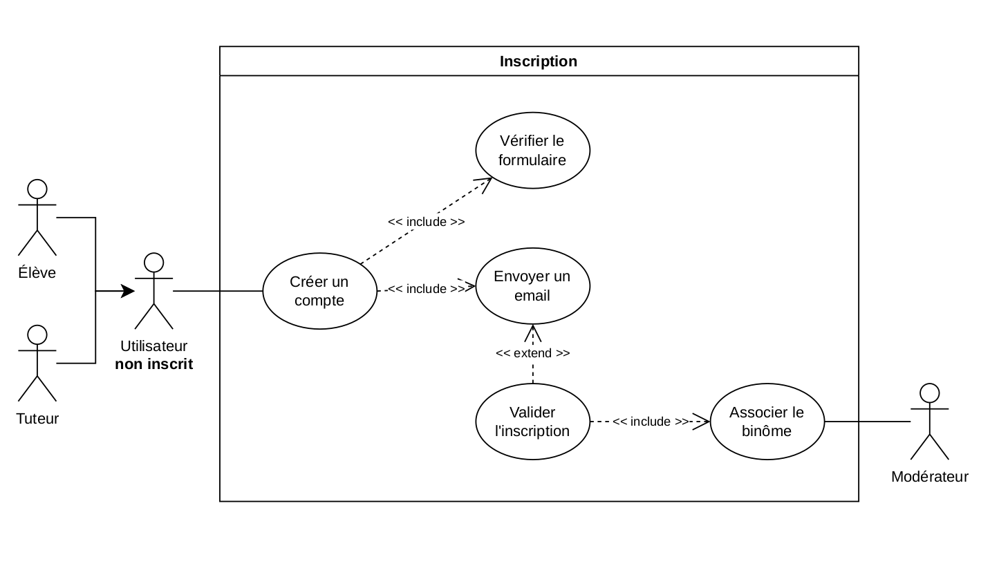
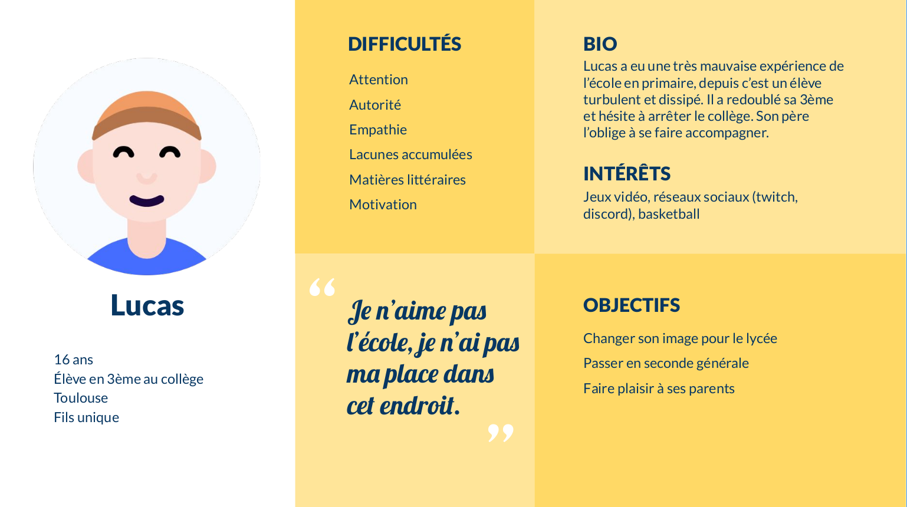
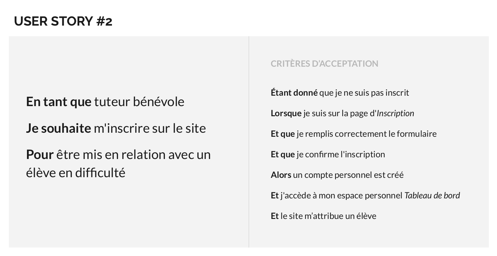
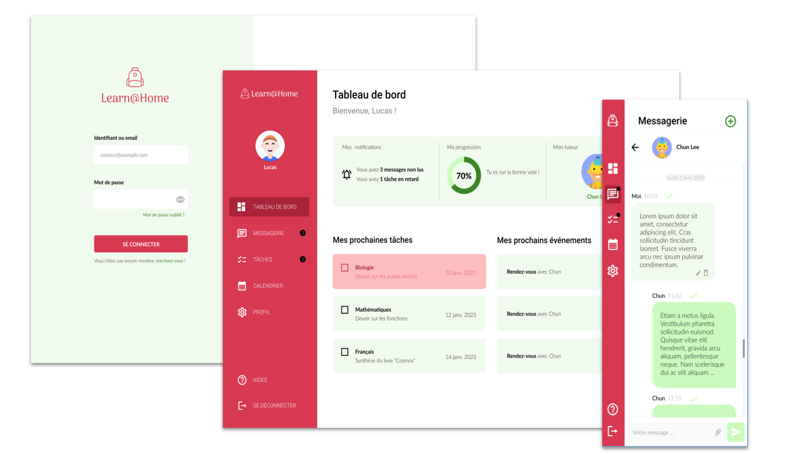

 

# oc-p10-learnathome
Projet n°10 de la formation [OpenClassrooms Front-End JS/React](https://openclassrooms.com/fr/paths/516-developpeur-dapplication-javascript-react).

## Contexte
- Employé depuis 5 ans chez Dev4U, lead développer de l’entité web.
- Entreprise de services du numérique : développement d’applications mobiles, dev Web
- Client **Learn@Home** : met en relation des enfants en difficulté scolaire et des bénévoles, en ligne

## Mission
- Définir les besoins client pour préparer la réunion de lancement
- Documents : cas d’usage, user stories, maquettes, kanban

## Use Cases
Voir le fichier use_cases.io (drawio)

## Persona
Voir le fichier user_stories.odp

## User Stories
Voir le fichier user_stories.odp et le [kanban](https://github.com/users/jeromeabel/projects/1) du projet.

## Maquette
Voir la maquette réalisée avec [Figma](https://www.figma.com/file/7b9KuU85XksOOEYOlMXto8/Maquette-Learn%40Home?node-id=3-2&t=RAjBGTfsb87GsyW9-0)

